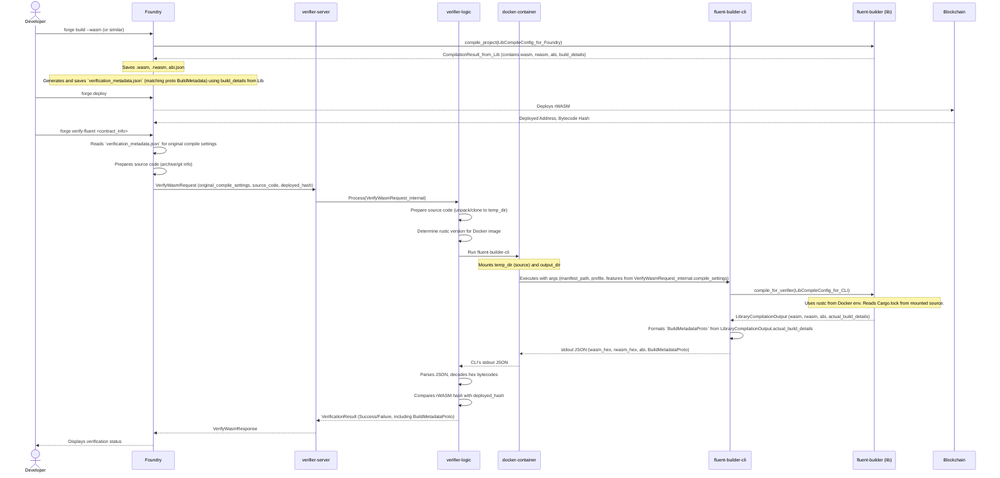

**Entities:**

1. **`Foundry`**: Developer's primary tool.
2. **`fluent-builder` (lib)**: The core Rust compilation library (from `fluent-builder-suite/crates/fluent-builder`).
3. **`fluent-builder-cli` (cli)**: The CLI wrapper around the library, executed by the verifier (from `fluent-builder-suite/crates/fluent-builder-cli`).
4. **`VerifyRequest` (proto)**: The gRPC/HTTP request to the verifier server.
5. **`verifier-server`**: The server handling verification requests.
6. **`verifier-logic`**: The core logic crate for the verification process.
7. **`docker-container`**: The isolated environment for running `fluent-builder-cli`.

**High-Level Architecture & Sequence:**



**Key Data Structures (Rust structs, names as currently in your code or proposed):**

Let's assume the names from your existing `fluent-builder-suite` and `fluent-verifier-logic`.

**1. Between `Foundry` and `fluent-builder` (lib):**

* **Input to `fluent-builder::compile()` (or `compile_contracts`)**:

    ```rust
    // In fluent-builder/src/config.rs
   pub struct CompileConfig {
    /// Project root directory
    pub project_root: PathBuf,

    /// Paths to scan for contracts (relative to project_root)
    /// If empty, will scan default locations
    pub contracts_paths: Vec<PathBuf>,

    /// Target triple for WASM compilation
    pub target: String,

    /// Build profile
    pub profile: BuildProfile,

    /// Features to enable during compilation
    pub features: Vec<String>,

    /// Whether to disable default features
    pub no_default_features: bool,

    /// Stack size for the WASM module (optional)
    pub stack_size: Option<usize>,

    pub cargo_flags: Vec<String>,
    pub rustc_flags: Option<String>,
    }
    ```

* **Output from `fluent-builder::compile()` (specifically from `CompiledContract`):**

    ```rust
    // In fluent-builder/src/compiler.rs
    pub struct CompiledContract { // What Foundry receives for each contract
        pub contract: WasmContract, // Contains name, version, path, sdk_version (parsed from Cargo.toml)
        pub wasm_bytecode: Vec<u8>,
        pub rwasm_bytecode: Vec<u8>,
        pub artifacts: artifacts::ContractArtifacts, // Contains .abi and .metadata (Foundry-specific)
        pub compile_config: CompileConfig, // The config used for this specific contract
    }

    // In fluent-builder/src/artifacts/mod.rs
    // This `BuildInfo` is used to create Foundry's `artifacts.metadata.build_metadata`
    pub struct BuildInfo {
        pub rustc_version: String, // Determined by lib using utils::get_rust_version()
        pub target: String,
        pub profile: String,
        pub features: Vec<String>,
        pub source_hash: String, // Overall Keccak256 source hash (Foundry specific)
        pub compile_config: CompileConfig, // Includes no_default_features
    }
    ```

    **Foundry's Task**: From `CompiledContract.contract`, `CompiledContract.compile_config`, and `BuildInfo` (which is accessible when `artifacts::metadata::generate` is called), Foundry needs to gather all fields to construct and save a `verification_metadata.json` file. This JSON file's structure should **exactly match** the `BuildMetadata` message defined in your `fluent-verifier.proto`.

**2. Between `Foundry` and `verifier-server` (`VerifyWasmRequest`):**

* This is defined by your `fluent-verifier.proto`:

    ```protobuf
    // fluent-verifier.proto
    message VerifyWasmRequest {
      oneof source_details {
        ArchiveSourceDetails archive_source = 1;
        GitSourceDetails git_source = 2;
      }
      string deployed_rwasm_bytecode_hash = 3;
      string chain_id = 4;
      string contract_address = 5;
      CompileSettings compile_settings = 6; // Crucial: params of the *original* Foundry build
    }

    message CompileSettings { // User-provided settings from original build
      string rustc_version = 1;          // e.g., "rustc 1.78.0 (commit_hash date)"
      string fluentbase_sdk_version = 2; // e.g., "0.5.0"
      string target_triple = 3;          // "wasm32-unknown-unknown"
      string profile = 4;                // "release"
      repeated string features = 5;
      bool no_default_features = 6;
      repeated string cargo_flags = 7;    // Additional cargo build flags used
      // We might need a field for RUSTFLAGS if they were used and affect output
      // optional string rust_flags_env = 8; 
    }
    ```

    **Rust struct equivalent (generated by Prost in `verifier-server` and `verifier-logic`):**

    ```rust
    // In verifier-server / verifier-logic (generated by Prost)
    pub struct VerifyWasmRequest {
        pub source_details: Option<verify_wasm_request::SourceDetails>,
        pub deployed_rwasm_bytecode_hash: String,
        pub chain_id: String,
        pub contract_address: String,
        pub compile_settings: Option<CompileSettings>,
    }

    pub struct CompileSettings { // Matches the proto CompileSettings
        pub rustc_version: String,
        pub fluentbase_sdk_version: String,
        pub target_triple: String,
        pub profile: String,
        pub features: Vec<String>,
        pub no_default_features: bool,
        pub cargo_flags: Vec<String>,
        // pub rust_flags_env: Option<String>, // If added to proto
    }
    ```

**3. Between `verifier-logic` and `fluent-builder-cli` (CLI arguments):**

* The CLI arguments we defined earlier:

    ```rust
    // In fluent-builder-cli/src/main.rs (Clap struct)
    struct CliArgs {
        manifest_path: PathBuf, // e.g., /source/Cargo.toml or /source/my_contract/Cargo.toml
        profile: String,        // e.g., "release"
        features: Option<Vec<String>>,
        no_default_features: bool,
        cargo_flag: Vec<String>, // For extra_cargo_build_flags
        rustflags: Option<String>, // For RUSTFLAGS env var
        // output_dir_name: String, // Not strictly needed if CLI just outputs hex to stdout
                                 // and verifier-logic doesn't need paths from CLI.
                                 // But if CLI *does* write files for wasm/rwasm paths in JSON, then needed.
                                 // For "minimal changes & hex output" CLI doesn't write these files to disk for verifier.
    }
    ```

    `verifier-logic` will construct these arguments based on `VerifyWasmRequest.compile_settings` and the path to the prepared source code in Docker.

**4. Between `fluent-builder-cli` and `fluent-builder` (lib) (API call):**

* **Input to `fluent-builder::compile_for_verifier()` (library function):**

    ```rust
    // In fluent-builder/src/config.rs (or lib.rs)
    // This is LibCompileConfig from our previous discussion
    pub struct LibCompileConfig {
        pub project_path: PathBuf, // Absolute path to contract dir inside Docker
        pub profile: BuildProfileName, // Enum: Debug, Release, Custom
        pub features: Vec<String>,
        pub no_default_features: bool,
        pub extra_cargo_build_flags: Vec<String>,
        pub rustflags_env: Option<String>,
        
        // Information passed by CLI for metadata generation consistency
        pub resolved_rustc_version_str: String, // Actual rustc version CLI is running with
        pub resolved_sdk_version_str: Option<String>, // SDK version parsed by CLI from project's Cargo.lock/toml
        pub target_triple_for_metadata: String, // Always "wasm32-unknown-unknown"
        
        // rWASM params (using defaults for now for minimal change)
        pub rwasm_entrypoint_name_override: Option<String>,
        pub rwasm_use_32bit_stack_mode: bool,
    }
    ```

* **Output from `fluent-builder::compile_for_verifier()` (library function):**

    ```rust
    // In fluent-builder/src/lib.rs (or types.rs)
    // This is LibraryCompilationOutput from our previous discussion
    pub struct LibraryCompilationOutput {
        pub wasm_bytecode: Vec<u8>,
        pub rwasm_bytecode: Vec<u8>,
        pub abi_json: serde_json::Value, // ABI as a single JSON Value
        pub package_name: String,
        pub package_version: String,
        // Plus all fields that were in VerifierBuildInfoCli / actual_... fields
        // These are the "facts" about the compilation the library performed.
        pub actual_compiler_name: String,
        pub actual_compiler_version_full: String,
        pub actual_compiler_commit_hash: Option<String>,
        pub actual_language: String,
        pub actual_setting_target_triple: String,
        pub actual_setting_profile_name: String,
        pub actual_setting_features_used: Vec<String>,
        pub actual_setting_no_default_features_used: bool,
        pub actual_contract_path_to_cargo_toml_relative: String,
        pub actual_contract_sdk_version: Option<String>,
        pub actual_setting_cargo_flags_passed: Vec<String>,
        pub actual_setting_rustflags_env_var_used: Option<String>,
        pub sources_details: BTreeMap<String, SourceFileVerificationDetails>,
    }

    pub struct SourceFileVerificationDetails { // Was VerifierSourceFileInfoCli
        pub content_hash_sha256: String,
        pub license_identifier: Option<String>,
    }
    ```

**5. Between `fluent-builder-cli` (stdout) and `verifier-logic` (`docker_runner.rs`):**

* **JSON output from CLI's stdout:**

    ```json
    {
      "contract_name": "string", // from LibraryCompilationOutput.package_name
      "package_name": "string",  // from LibraryCompilationOutput.package_name
      "wasm_bytecode_hex": "string",
      "rwasm_bytecode_hex": "string",
      "abi": { /* ABI JSON object/array */ }, // from LibraryCompilationOutput.abi_json
      "build_metadata_proto_compliant": { /* JSON object matching proto BuildMetadata */ }
    }
    ```

    Where `build_metadata_proto_compliant` is constructed by the CLI using the `actual_...` fields from `LibraryCompilationOutput`.
* **`verifier-logic` (`docker_runner.rs`) parses this into `CompilerOutput`:**

    ```rust
    // In fluent-verifier-logic/src/docker_runner.rs
    pub struct CompilerOutput { // This is what docker_runner returns
        pub wasm_bytecode: Bytes,  // Decoded from hex
        pub rwasm_bytecode: Bytes, // Decoded from hex
        pub abi: serde_json::Value,
        pub metadata: serde_json::Value, // This will be the build_metadata_proto_compliant JSON Value
        pub contract_name: String,
        pub package_name: String,
        pub compile_logs: String, // Logs from CLI execution
    }
    ```

**6. Between `verifier-logic` and `verifier-server` (`VerificationSuccess`):**

* ```rust
    // In fluent-verifier-logic/src/types.rs
    pub struct VerificationSuccess {
        pub contract_name: String,
        pub package_name: String,
        pub wasm_bytecode: Bytes,
        pub rwasm_bytecode: Bytes,
        pub abi: serde_json::Value,
        pub build_metadata: serde_json::Value, // The build_metadata_proto_compliant JSON value
        pub source_files: BTreeMap<String, String>, // Content of source files from archive/git
        pub rustc_version: Version, // Resolved rustc version used for this verification run
        pub fluentbase_sdk_version: Version, // Resolved SDK version for this verification run
        pub compile_logs: String,
    }
    ```

**7. Between `verifier-server` and `Foundry` (`VerifyWasmResponse`):**

* This is defined by your `fluent-verifier.proto`:

    ```protobuf
    message VerifyWasmResponse {
      Status status = 1;
      optional WasmVerificationSuccess success_details = 2;
      optional WasmVerificationFailure failure_details = 3;
    }

    message WasmVerificationSuccess {
      string contract_name = 1;
      optional string abi_json_string = 2; // ABI serialized to string
      optional BytecodeObject wasm_bytecode = 3;  // Hex string
      optional BytecodeObject rwasm_bytecode = 4; // Hex string
      map<string, string> method_identifiers = 5;
      optional BuildMetadata build_metadata = 6; // The crucial part, matching the proto definition
    }
    ```

    `verifier-server` will take `VerificationSuccess.build_metadata` (which is already a `serde_json::Value` representing the proto-compliant `BuildMetadata`) and serialize it into the `WasmVerificationSuccess.build_metadata` field. This requires `build.rs` in `fluent-verifier-proto` to correctly handle `serde` for the `BuildMetadata` message if it's directly embedded, or for the server to manually construct the proto `BuildMetadata` message from the `serde_json::Value`. The latter is more robust.
